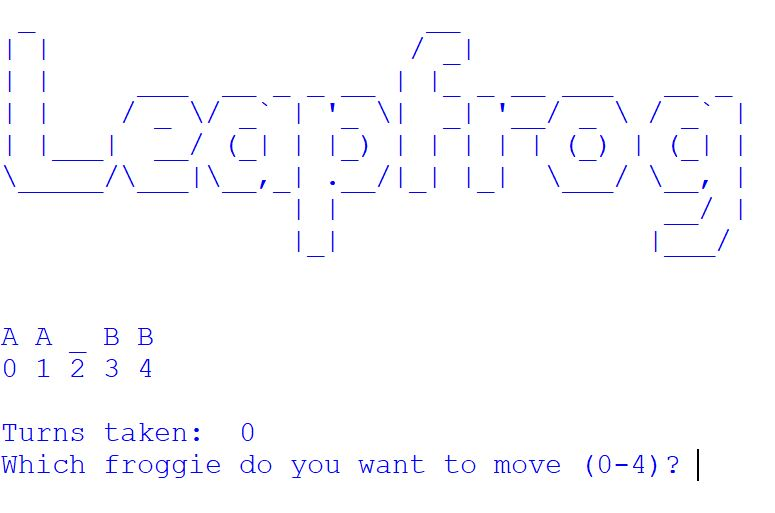

# Leapfrog

A fun console game in Python based on a "get out of that" team challenge.

The goal is to swap the positions of team A and team B so the initial configuration is reversed. There is only one empty spot (lillypad). The only legal moves are "hopping" (move one place left or right), or "leapfrogging" (jumping over one player next to you into the empty spot). There is no rule about the order in which players move.

